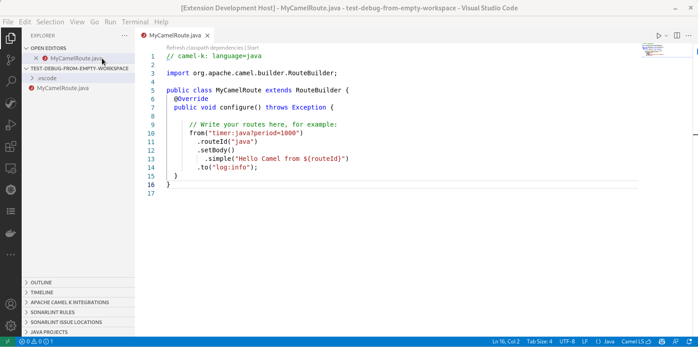

<h1 align="center">
 
  
 Debug Adapter for Apache Camel
</h1>

 
 
 
 

 

<h2 align="center">DAP Client for Visual Studio Code.</h2>

  <a href="#features">Features</a> •
  <a href="#requirements">Requirements</a> •
  <a href="#how-to-debug">Example</a> •
  <a href="https://camel-tooling.github.io/camel-dap-client-vscode/">Documentation</a> •
  <a href="#issues">Issues</a>  •
  <a href="#data-and-telemetry">Telemetry</a>

This is the <a href="https://code.visualstudio.com/">Visual Studio Code</a> extension that adds <a href="https://camel.apache.org/manual/debugger.html">Camel Debugger</a> power by attaching to a running Camel route written in Java, Yaml or XML DSL.

 

### Features

- `Camel Main` mode for XML only (It implies that it is not working with Camel context specified in Camel XML file.)
- Support use of Camel debugger by attaching to a running Camel route written in Java, Yaml or XML using the JMX Url
- Support local use of Camel debugger by attaching to a running Camel route written in Java, Yaml or XML using the PID
- Support remote debug through http (when using Jolokia on server-side)
- Support a single Camel context
- Add/Remove breakpoints
- Support conditional breakpoints with `simple` language. See How to write condition with [simple language](https://camel.apache.org/components/latest/languages/simple-language.html) for details.
- Inspect variable values on suspended breakpoints
- Resume a single route instance and resume all route instances
- Pause/resume route definition. Technically, it suspend/stop and resume/start Camel routes depending on the kind of consumer.
- Stepping when the route definition is in the same file
- Allow to update variables:
  - in scope `Debugger`
  - the message body
  - a message header of type String
  - an exchange property of type String
- Commands `Run with JBang and Debug Opened Camel Integration`, `Run with JBang and Debug All Camel Integrations from workspace root` and `Run with JBang and Debug All Camel Integrations from containing folder`. It allows a one-click start and Camel debug in simple cases. This command is available through:
  - Command Palette. It requires a valid Camel file opened in current editor.
  - Contextual menu in File explorer. It is visible to all `*.xml`, `*.java`, `*.yaml` and `*.yml`.
  - Codelens at the top of a Camel file (the heuristic for the codelens is checking that there is a `from` and a `to` or a `log` on `java`, `xml` and `yaml` files).
  - `Run or debug...` quick action editor
- Commands `Run with JBang and Debug Opened Camel Integration`, `Run with JBang Opened Camel Integration` and `Run with JBang All Camel Integrations from workspace root`
  - Support automatic reload mode `--dev` by default
  - It requires a valid Camel file defined in Yaml DSL (`.yaml|.yml`) opened in editor.
  - Contextual menu in File explorer. It is visible to all `*.yaml` and `*.yml`.
  - Codelens at the top of a Camel file.
  - `Run or debug...` quick action editor
- Supports adding extra parameters provided by the `Run with JBang *` commands. (For both running and debugging the application)
- Configuration snippets for Camel debugger launch configuration
- Configuration snippets to launch Camel application ready to accept a Camel debugger connection using JBang, Maven with Camel maven plugin or Quarkus Devs
- Deploy Integration (standalone Camel file) with [Apache Camel Kubernetes](https://camel.apache.org/manual/camel-jbang-kubernetes.html) plugin.
  - It allows **one-click deployment into OpenShift** by default
  - requires Camel JBang 4.8+
  - for deployment into Kubernetes cluster see [how to deploy into local Kubernetes cluster](./docs/content/kubernetes-deploy.md)

### Requirements

- **Java Runtime Environment 17+** with `com.sun.tools.attach.VirtualMachine` (available in most JVMs such as Hotspot and OpenJDK). The `java.home` VS Code preferences can be used to use a different version of JDK than the default one installed on the machine.

- The Camel instance to debug must follow these requirements:
  - **Camel 3.16+**
  - Have `camel-debug` on the classpath
  - Have **JMX enabled**
- ⚠️ For some features, The [JBang](https://www.jbang.dev/) must be available on a system command-line.

### How To Debug - example

1. Ensure `jbang` is available on system command-line
2. Open a Camel route which can be started with JBang
3. Call command Palette (`Ctrl + Shift + P`), and pick command `Run with JBang and Debug Opened Camel Integration` or click on codelens `Camel Debug with JBang` which appears on top of the file or use the quick editor action
4. Wait until the route is started and debugger is connected
5. Put a breakpoint on the Camel route
6. Debug! 🔥

### Documentation

Our full documentation is located in [GitHub pages](https://camel-tooling.github.io/camel-dap-client-vscode/). Included are details about all of DAP Client for Visual Studio Code capabilities with examples and detailed information.

### Issues

Something is not working properly? In that case, feel free to [open issues, add feature requests, report bugs, etc.](https://github.com/camel-tooling/camel-dap-client-vscode/issues)

### Get Involved

If you'd like to help us get better, we appreciate it! Check out our [Contribution Guide](Contributing.md) on how to do that.

### Data and Telemetry

The DAP Client for Visual Studio Code extension collects anonymous [usage data](USAGE_DATA.md) and sends it to Red Hat servers to help improve our products and services. Read our [privacy statement](https://developers.redhat.com/article/tool-data-collection) to learn more. This extension respects the `redhat.telemetry.enabled` setting which you can learn more about at [How to disable telemetry reporting](https://github.com/redhat-developer/vscode-redhat-telemetry#how-to-disable-telemetry-reporting).
