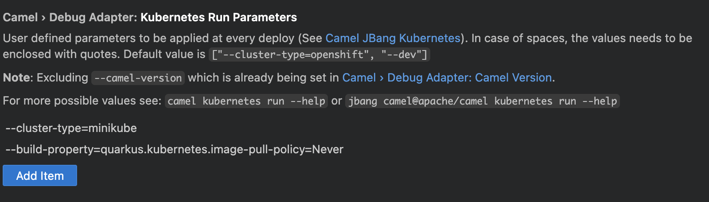

# How to deploy into local Kubernetes cluster

By default, the deployment aims OpenShift cluster. In case you need to deploy into Kubernetes, there is a small modification needed:

1) open Settings UI in VS Code
2) navigate to `Extensions > Debug Adapter for Apache Camel`
3) modify setting `Camel > Debug Adapter: Kubernetes Run Parameters` as you can see on picture below



The picture describes how to deploy to local Kubernetes cluster using Minikube. You can use eg. also `Kind`. In that case, just change to `--cluster-type=kind`.

For more information see [Camel Kubernetes plugin official documentation](https://camel.apache.org/manual/camel-jbang-kubernetes.html).

## Follow logs

You can use Camel CLI to obtain logs of current running integration. In terminal window execute:

```shell
jbang camel@apache/camel kubernetes logs --name=<name>
```

## Undeploy

To remove current integration, you can use also Camel CLI. In this case the command is:

```shell
jbang camel@apache/camel kubernetes delete --name=<name>
```
